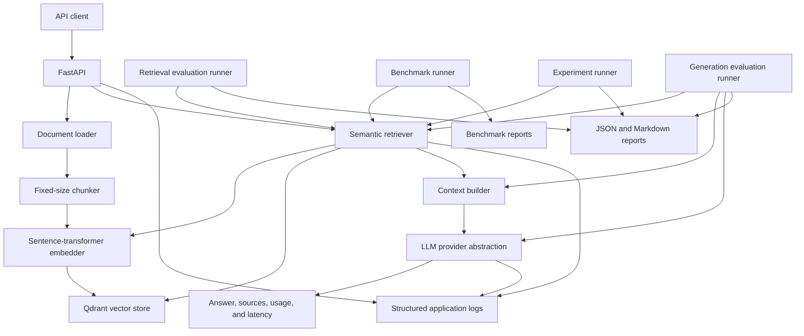

# RAGBench

Retrieval-Augmented Generation Evaluation & Inference Platform

RAGBench is a Python 3.11+ platform for running and evaluating a retrieval-augmented generation pipeline with sentence-transformer embeddings, Qdrant retrieval, grounded LLM generation, stage-level timing, reproducible retrieval metrics, and controlled experimentation.

## Problem

A generated answer can sound plausible when retrieval selected irrelevant evidence, missed the necessary passage, or supplied contradictory material. Evaluating only the final text hides the stage responsible for an error and makes changes to chunking, retrieval, prompts, or models difficult to compare.

RAGBench exposes retrieved chunks, scores, source metadata, provider usage, and latency boundaries alongside the answer. V2 adds a versioned retrieval dataset, Recall@1, Recall@3, Recall@5, MRR, per-query artifacts, and baseline comparison. V3 adds controlled single-variable retrieval experiments (chunking, top-k, embeddings), isolated in-memory vector index evaluation, and per-query latency distributions. V4 adds generation quality evaluation (answer correctness, faithfulness/groundedness, context relevance), dataset version 1.1.0 with 28 questions and required facts, decoupled LLM-as-a-judge, and stage-classified failure analysis. V5 adds provider-neutral cost accounting, request observation tracing, bounded safe retries, health/readiness probes, a multi-dimensional regression detection engine, and automated CI quality gating.

## What the system evaluates

| Dimension | Status | Current behavior |
| --- | --- | --- |
| Retrieval quality | Implemented | Versioned dataset, document-level Recall@1/3/5, MRR, per-query failure records, and single-variable experiment comparison |
| Context quality | Implemented | Context relevance measuring evidence proportion in retrieved chunks |
| Answer quality | Implemented | Deterministic answer correctness against grounded required facts; faithfulness measuring claim grounding in retrieved context; optional LLM-as-a-judge |
| Latency | Implemented | Per-request timing instrumentation; benchmark and experiment aggregation reporting mean, p50, p95, and p99 for embedding, retrieval, and generation |
| Token usage | Implemented | Normalized input, output, and total token usage per query and run |
| Cost | Implemented in V5 | Provider-neutral pricing schedule (`data/pricing.yaml`) calculating input/output/total cost and cost per query |
| Reliability | Implemented in V5 | Request failure rate, timeout counts, and provider error tracking |
| Regression detection | Implemented in V5 | Multi-dimensional comparison engine (quality, latency, cost, reliability) with tri-state decisions and CI gate |

The latency fields include per-request observations and aggregate benchmark measurements (mean, p50, p95, p99) computed across query repetitions with explicit warmup separation.

## Architecture



The API and Qdrant run as separate services in development (Docker) or production (FastAPI on Render Free + Qdrant Cloud).

### Embedding Runtime Separation (Production vs. Evaluation)

- **Production API**:
  - **Provider & Model**: `FastEmbedEmbedder` + `BAAI/bge-small-en-v1.5`
  - **Runtime**: ONNX Runtime (`fastembed>=0.7,<1`, CPU inference without PyTorch/CUDA overhead)
  - **Memory Footprint**: ~85 MB idle, ~240 MB peak active inference (fits within Render Free's 512 MB RAM limit)
  - **Default Qdrant Collection**: `ragbench_documents_bge` (384-dimensional cosine distance, preventing vector space contamination with older models)
- **Evaluation & Historical Experiments**:
  - **Provider & Model**: `SentenceTransformerEmbedder` + historical `sentence-transformers/all-MiniLM-L6-v2` baseline
  - **Runtime**: PyTorch + `sentence-transformers` (declared in `requirements-eval.txt`)
  - **Purpose**: Full reproducibility of historical evaluation reports, benchmark metrics, and ablation studies

Generation is an asynchronous HTTP call through the implemented OpenAI-compatible provider. Reranking and hybrid retrieval are not implemented.

See [Architecture](docs/architecture.md) for component contracts and failure boundaries.

## Core workflow

The implemented online path is:

```text
Ingest -> Chunk -> Embed -> Index -> Retrieve -> Build context -> Generate
```

The implemented experimental path is:

```text
Baseline -> Change ONE variable -> Evaluate -> Collect latency -> Compare with baseline -> Record interpretation
```

The generation evaluation path is:

```text
Question -> Production retriever -> Context builder -> Configured LLM -> Generated answer -> Generation evaluator
```

`POST /ingest` accepts a UTF-8 plain-text or Markdown upload. It assigns a content-derived document ID, creates deterministic character chunks, embeds them, and upserts them into Qdrant. `POST /query` embeds the query, performs cosine-similarity top-k retrieval, builds a bounded context, and calls the configured LLM provider. When retrieval returns no chunks, the pipeline returns an insufficient-context response without calling the LLM.

## Evaluation & Experiments

V2 includes a hand-authored, versioned corpus of five documents and ten questions. The runner indexes the corpus through the production loader, chunker, embedder, Qdrant adapter, and semantic retriever. Metrics operate at document level. Duplicate document IDs from multiple retrieved chunks are collapsed in first-occurrence order before rank cutoffs are applied.

V3 introduces controlled experiments that enforce single-variable modifications against the fixed baseline, executing on isolated vector stores to prevent cross-experiment contamination.

V4 introduces generation quality evaluation (answer correctness, faithfulness, and context relevance) against dataset version 1.1.0 (28 questions with corpus-grounded required facts).

Run the baseline evaluation:

```bash
python -m ragbench.eval
```

Run generation quality evaluation:

```bash
python -m ragbench.eval_generation
```

Run a controlled experiment:

```bash
python -m ragbench.experiments run experiments/chunking/400_50.yaml
```

Run repeated benchmark measurements with warmup cycles:

```bash
python -m ragbench.experiments benchmark --config experiments/baseline/config.yaml --warmup 2 --runs 5
```

Compare two result files:

```bash
python -m ragbench.experiments compare evaluation/reports/baseline.json evaluation/reports/chunk-400-50.json
```

See [Evaluation](docs/evaluation.md), [Experiments](docs/experiments.md), and [Benchmarking](docs/benchmarking.md).

## Results

### V2/V3 Retrieval Baseline & Experiments (Dataset v1.0.0, 10 Queries)

| Experiment ID | Varied Parameter | Recall@1 | Recall@3 | Recall@5 | MRR | MRR Delta |
| --- | --- | ---: | ---: | ---: | ---: | ---: |
| `baseline` | (Reference) | 0.900000 | 0.900000 | 1.000000 | 0.925000 | 0.000000 |
| `chunk-400-50` | `chunk_size=400, overlap=50` | 0.900000 | 1.000000 | 1.000000 | 0.950000 | +0.025000 |
| `chunk-1200-150` | `chunk_size=1200, overlap=150` | 0.900000 | 0.900000 | 1.000000 | 0.925000 | 0.000000 |
| `topk-1` | `top_k=1` | 0.900000 | 0.900000 | 0.900000 | 0.900000 | -0.025000 |
| `topk-3` | `top_k=3` | 0.900000 | 0.900000 | 0.900000 | 0.900000 | -0.025000 |
| `topk-5` | `top_k=5` | 0.900000 | 0.900000 | 1.000000 | 0.925000 | 0.000000 |
| `topk-10` | `top_k=10` | 0.900000 | 0.900000 | 1.000000 | 0.925000 | 0.000000 |
| `embed-paraphrase-minilm-l3-v2` | `embedding_model=paraphrase-MiniLM-L3-v2` | 0.900000 | 1.000000 | 1.000000 | 0.950000 | +0.025000 |

### V4 Generation Quality Baseline (Dataset v1.1.0, 28 Queries)

Evaluated via `python -m ragbench.eval_generation` on dataset `ragbench-v4-generation` version `1.1.0` (fingerprint `255edea5ef99c742a1d9a6ddeeb04d1174815658ee35825d2d2881d9d52fd49d`):

| Evaluation Dimension | Metric | Score | Description |
| --- | --- | ---: | --- |
| Retrieval | Recall@1 | 0.857143 | Target document retrieved at rank 1 |
| Retrieval | Recall@3 | 0.964286 | Target document retrieved in top 3 |
| Retrieval | Recall@5 | 1.000000 | Target document retrieved in top 5 |
| Retrieval | MRR | 0.907738 | Mean reciprocal rank of target document |
| Generation | Correctness | 0.744048 | Fraction of required facts satisfied |
| Generation | Faithfulness | 1.000000 | Fraction of answer claims grounded in context |
| Generation | Context Relevance | 0.528571 | Density and ranking of target evidence in context |

### Benchmark Latency Measurements (Steady-State Query Latency)

| Configuration | Embedding Mean | Embedding p50 | Embedding p95 | Retrieval Mean | Retrieval p50 | Retrieval p95 | Generation Mean | Generation p50 | Generation p95 |
| --- | ---: | ---: | ---: | ---: | ---: | ---: | ---: | ---: | ---: |
| V3 Baseline (`all-MiniLM-L6-v2`) | 7.22 ms | 6.84 ms | 10.96 ms | 0.30 ms | 0.28 ms | 0.36 ms | — | — | — |
| V3 Compact (`paraphrase-MiniLM-L3-v2`) | 3.45 ms | 3.37 ms | 4.43 ms | 0.32 ms | 0.30 ms | 0.44 ms | — | — | — |
| V4 Generation Pipeline | 11.92 ms | 8.17 ms | 24.33 ms | 0.40 ms | 0.32 ms | 0.48 ms | 0.27 ms | 0.26 ms | 0.29 ms |

These are measured results for repository-specific benchmark suites, not broad statistical claims. Source reports are preserved under [evaluation/reports/](evaluation/reports/) and [benchmarks/reports/](benchmarks/reports/).

The automated test suite currently reports **150 passing tests**.

## Failure cases

RAGBench classifies failures by the pipeline stage responsible:

| Failure Type | Description |
| --- | --- |
| `retrieval_failure` | Target relevant document was absent from all top-k candidates |
| `context_failure` | Context relevance is below 0.25 (target document missing or overwhelmed by non-target noise) |
| `generation_failure` | Retrieved context was relevant, but generated answer missed required facts (correctness < 0.70) |
| `grounding_failure` | Generated answer asserted claims unsupported by retrieved context (faithfulness < 0.70) |
| `provider_failure` | Generation provider or judge timed out, crashed, or returned malformed structure |

In the V4 baseline generation run, 13 generation failures were identified (all missing required reference facts despite relevant context), and 0 grounding failures were observed (100% claim faithfulness to retrieved evidence). See [Failure analysis](docs/failure-analysis.md).

## Repository structure

```text
.
├── ragbench
│   ├── app
│   │   ├── api/routes          # Health, ingestion, and query routes
│   │   ├── context             # Deterministic context construction
│   │   ├── core                # Typed settings and JSON logging
│   │   ├── domain              # Internal models and errors
│   │   ├── embeddings          # Embedding interface and sentence-transformer adapter
│   │   ├── generation          # LLM interface and OpenAI-compatible adapter
│   │   ├── ingestion           # Document loader, chunker, and indexing service
│   │   ├── pipeline            # Query orchestration and timing
│   │   ├── retrieval           # Top-k semantic retrieval
│   │   ├── schemas             # API models
│   │   ├── vector_store        # Store interface and Qdrant adapter
│   │   ├── main.py             # FastAPI factory, lifecycle, and errors
│   │   └── services.py         # Runtime dependency assembly
│   ├── experiments             # Experiment CLI, configuration validator, and runner
│   └── eval_generation.py      # Generation quality evaluation entrypoint
├── benchmarks                  # Benchmarking runner, environment capture, and timing stats
├── experiments                 # Experiment YAML specifications & machine-readable registry
├── evaluation
│   ├── dataset
│   │   ├── corpus              # Versioned benchmark documents
│   │   ├── metadata.json       # Dataset v1.0.0 metadata
│   │   ├── questions.jsonl     # Dataset v1.0.0 questions
│   │   └── v1.1.0/             # Dataset v1.1.0 (28 questions with required facts)
│   ├── generation_evaluator.py # Deterministic and LLM-judge evaluators
│   ├── generation_runner.py    # End-to-end generation evaluation runner
│   ├── retrieval_metrics.py    # Recall@K and reciprocal rank
│   ├── evaluator.py            # Production-retriever evaluation
│   ├── runner.py               # Baseline retrieval evaluation CLI
│   └── reports                 # Machine and human-readable experiment reports
├── docs
│   ├── decisions               # Architecture Decision Records (ADR 001 - 007)
│   ├── evaluation.md
│   ├── experiments.md
│   ├── benchmarking.md
│   ├── failure-analysis.md
│   └── rag-pipeline.md
├── tests
│   ├── evaluation
│   ├── integration
│   └── unit
├── pyproject.toml
├── requirements.txt         # Production runtime (FastEmbed, no PyTorch)
└── requirements-eval.txt    # Evaluation & historical benchmarks (SentenceTransformers + PyTorch)
```

## Running locally

Prerequisites:

- Python 3.11 or newer
- Docker with Compose for Qdrant
- an API key for the configured OpenAI-compatible provider when generation is required

Create the environment and install dependencies:

**For Production API (Lightweight, FastEmbed):**

```bash
python3 -m venv .venv
source .venv/bin/activate
python -m pip install --upgrade pip
python -m pip install -e . -r requirements.txt
cp .env.example .env
```

**For Evaluation & Historical Benchmark Reproducibility:**

```bash
python -m pip install -r requirements-eval.txt
```

Start Qdrant and the API:

```bash
docker compose up -d qdrant
uvicorn ragbench.app.main:app --reload
```

## Production Deployment (Render Free)

RAGBench is designed to run cleanly on Render Free (512 MB RAM limit):

1. **Repository Settings**:
   - **Environment**: Python 3.11+
   - **Build Command**:
     ```bash
     pip install --upgrade pip && pip install -r requirements.txt && python -c "from fastembed import TextEmbedding; TextEmbedding('BAAI/bge-small-en-v1.5')"
     ```
     *(Installs FastEmbed with ONNX Runtime and pre-caches model weights at build time; PyTorch and CUDA dependencies are completely omitted).*
   - **Start Command**:
     ```bash
     uvicorn ragbench.app.main:app --host 0.0.0.0 --port 10000
     ```

2. **Environment Variables**:
   - `QDRANT_URL`: URL to your Qdrant Cloud cluster (e.g. `https://xxxx.cloud.qdrant.io:6333`)
   - `QDRANT_API_KEY`: API key for Qdrant Cloud
   - `QDRANT_COLLECTION`: `ragbench_documents_bge` (ensures 384-d BGE vectors do not mix with older models)
   - `EMBEDDING_PROVIDER`: `fastembed`
   - `EMBEDDING_MODEL`: `BAAI/bge-small-en-v1.5`
   - `LLM_API_KEY`: API key for the LLM provider
   - `LLM_PROVIDER`: `openai` (or `mock` for testing)
   - `LLM_MODEL`: `gpt-4o-mini`

## Testing

Run the verified checks from the repository root:

```bash
ruff format --check .
ruff check .
pytest
```

- **Unit tests** cover loading, chunking, embedding, context construction, schemas, retrieval result handling, pipeline behavior, provider parsing, experiment config validation, timing statistics, generation dataset validation, fact matching, and LLM judge validation.
- **Integration tests** exercise document ingestion, in-memory Qdrant retrieval, API routes, experiment runner execution, isolated index cleanup, and end-to-end generation quality evaluation.

## Engineering decisions

- [ADR-001: Use Qdrant for vector storage](docs/decisions/001-vector-store.md)
- [ADR-002: Use fixed-size character chunks for the baseline](docs/decisions/002-chunking-strategy.md)
- [ADR-003: Use dense top-k retrieval without reranking](docs/decisions/003-retrieval-strategy.md)
- [ADR-004: Stage-level retrieval evaluation](docs/decisions/004-evaluation-strategy.md)
- [ADR-005: Controlled retrieval experimentation](docs/decisions/005-controlled-experiments.md)
- [ADR-006: Benchmark methodology and latency distribution](docs/decisions/006-benchmarking-methodology.md)
- [ADR-007: Deterministic generation evaluation and decoupled LLM-as-a-judge](docs/decisions/007-generation-evaluation.md)

## Known limitations

- The generation evaluation dataset contains 28 hand-authored questions across five short documents.
- Relevance labels are document-level and include one relevant document per question.
- Character chunking can split sentences, Markdown structures, and tables.
- Deterministic fact matching relies on human-curated facts and token containment; semantic paraphrasing with disjoint vocabulary requires the decoupled LLM judge.
- External LLM generation requires network access and API credentials.

## Future work

Future milestones will expand relevance and fact labels across external multi-document corpora, evaluate hybrid retrieval (combining dense embeddings with BM25), evaluate cross-encoder rerankers, and implement automated CI quality regression gates.
