# Architecture

## Status

RAGBench implements one API process, one Qdrant service, local sentence-transformer inference, one asynchronous OpenAI-compatible generation adapter, and an offline retrieval evaluation runner. Generation metrics and a service benchmark runner remain planned.

## Components

### API

`ragbench.app.main` creates the FastAPI application, assembles services during the lifespan, assigns a UUID request ID, emits structured request logs, and maps domain errors to HTTP responses. Implemented routes are `GET /health`, `POST /ingest`, and `POST /query`.

### Ingestion

`DocumentLoader` accepts UTF-8 `.txt`, `.md`, and `.markdown` content. A SHA-256 digest of the original bytes is the document ID. Metadata contains `source`, `filename`, and `document_id`. Empty, unsupported, and undecodable documents are rejected.

### Chunker

`FixedSizeChunker` uses character counts with explicit size and overlap. Each chunk records a deterministic ID, source document ID, original metadata, chunk index, and start and end character offsets.

### Embedding service

`SentenceTransformerEmbedder` implements a synchronous embedding interface for documents and queries. The configured model is loaded once at application startup. Vectors are normalized by the library, and the model-reported dimension configures Qdrant.

### Vector store

`QdrantVectorStore` implements collection creation, dimension validation, chunk upsert, cosine search, and payload reconstruction through `AsyncQdrantClient`. Chunk IDs are mapped to deterministic UUID point IDs while the original IDs remain in payloads.

### Retrieval layer

`SemanticRetriever` embeds a query and performs top-k vector search. It returns typed ranked chunks containing score, text, document ID, chunk ID, and metadata. Query embedding and vector-search latency are measured separately.

### Reranker

Not implemented in V1.

### Context builder

`ContextBuilder` formats retrieved chunks in rank order with explicit source boundaries and identifiers. It enforces a configurable character limit. The limit is not tokenizer-aware.

### LLM provider

`LLMProvider` defines an asynchronous generation boundary. `OpenAICompatibleProvider` implements the chat-completions HTTP request with configurable model, base URL, timeout, temperature, and output-token limit. Provider timeouts and malformed responses are classified separately. No API key is logged or returned.

### Evaluation engine

The offline V2 runner validates a versioned corpus and question set, indexes it through production ingestion, calls `SemanticRetriever`, and calculates document-level Recall@1/3/5 and MRR. It writes aggregate and per-query JSON plus a Markdown summary. Generation metrics are not implemented.

### Benchmark runner

Planned. Per-request timers exist, but no repeatable workload runner or aggregate report exists.

### Observability

Implemented JSON logs identify request completion, retrieval, generation, and handled failure events by request ID. The API response exposes stage timings and provider-reported token usage. There is no metrics backend, distributed tracing, dashboard, or alert configuration.

## Request flow

```mermaid
sequenceDiagram
    participant Client
    participant API as FastAPI
    participant Retriever
    participant Embedder
    participant Qdrant
    participant Context as Context Builder
    participant LLM as LLM Provider

    Client->>API: POST /query
    API->>API: Validate QueryRequest
    API->>Retriever: query, top_k
    Retriever->>Embedder: embed_query
    Embedder-->>Retriever: normalized vector
    Retriever->>Qdrant: cosine top-k search
    Qdrant-->>Retriever: scored chunk payloads
    Retriever-->>API: RetrievalResult and timings
    API->>Context: ranked chunks
    Context-->>API: bounded context and included chunks
    alt chunks available
        API->>LLM: grounded prompt
        LLM-->>API: answer, model, token usage
    else no chunks
        API->>API: insufficient-context response
    end
    API-->>Client: answer, sources, latency, usage
```

FastAPI handlers and network calls to Qdrant and the LLM are asynchronous. Sentence-transformer inference is CPU or accelerator work and remains synchronous in V1. It is not hidden behind an async wrapper. Under concurrent load it can block the API event loop, which is a measured-scaling concern for a later version.

## Data flow

| Stage | Input | Output |
| --- | --- | --- |
| Load | Filename and uploaded bytes | `Document` with content-derived ID and metadata |
| Chunk | `Document` | Ordered `Chunk` records with offsets and provenance |
| Embed | Chunk texts or query text | Normalized vectors using one configured model |
| Index | Chunks and vectors | Qdrant points with chunk payloads |
| Retrieve | Query vector and top-k | Ranked `RetrievedChunk` records with cosine scores |
| Build context | Ranked chunks | Deterministic bounded text and included-chunk list |
| Generate | System prompt, context, question | Answer, model ID, and optional usage counts |
| Respond | Generation and retrieval artifacts | Typed JSON response and latency breakdown |

## Failure boundaries

| Failure | Implemented behavior |
| --- | --- |
| Embedding generation fails | Raises `embedding_error`; API returns HTTP 502 without exposing the underlying exception |
| Vector search or upsert fails | Raises `vector_store_error`; API returns HTTP 502 |
| LLM request times out | Raises `llm_timeout`; API returns HTTP 504 |
| Malformed document is supplied | Loader rejects unsupported, empty, or non-UTF-8 input with HTTP 400 |
| No documents are retrieved | Pipeline returns an insufficient-context answer and does not call the LLM |
| Provider returns invalid JSON shape | Raises `llm_provider_error`; API returns HTTP 502 |
| Request schema is malformed | API returns HTTP 422 with a request ID and does not echo the invalid content |

There is no automatic retry, circuit breaker, transactional rollback across multi-chunk upserts, or dead-letter handling.

## Scaling considerations

No load benchmark has been run. Likely bottlenecks are synchronous embedding in the API process, model memory per worker, context growth, Qdrant network latency, and provider limits. Multiple Uvicorn workers would each load the embedding model, trading concurrency for memory. Moving embedding to a bounded worker pool or a separate service should be considered only after profiling shows the need. Generation and Qdrant concurrency should be bounded before load is increased. These are possible changes, not implemented behavior.
